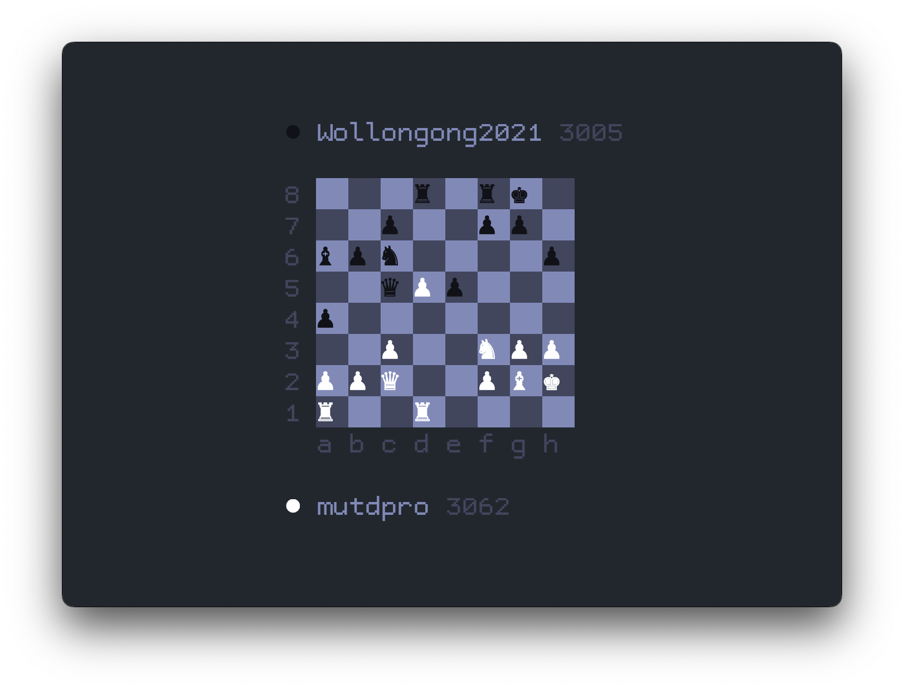

# LiTV - Watching live chess from your terminal

LiTV is a command line application that allows you to watch featured chess matches
on Lichess right from your terminal.



## How to build

Currently, there is no prebuilt binaries. You'll have to compile the code yourself.
To build LiTV, you will need to install a couple of things:

- Clang
- CMake
- libncurses
- libcurl

Then build with the following commands:

```
$ ./build only
```

After the build, you can find the `litv` binary in the `build` folder:

```
$ cd build && ./litv
```

## Development

If you're using Vim, it's recommended to install LSP client with `ccls` or `clangd` clients.

Then, you can run `./setup.sh` to have the development environment configured.
